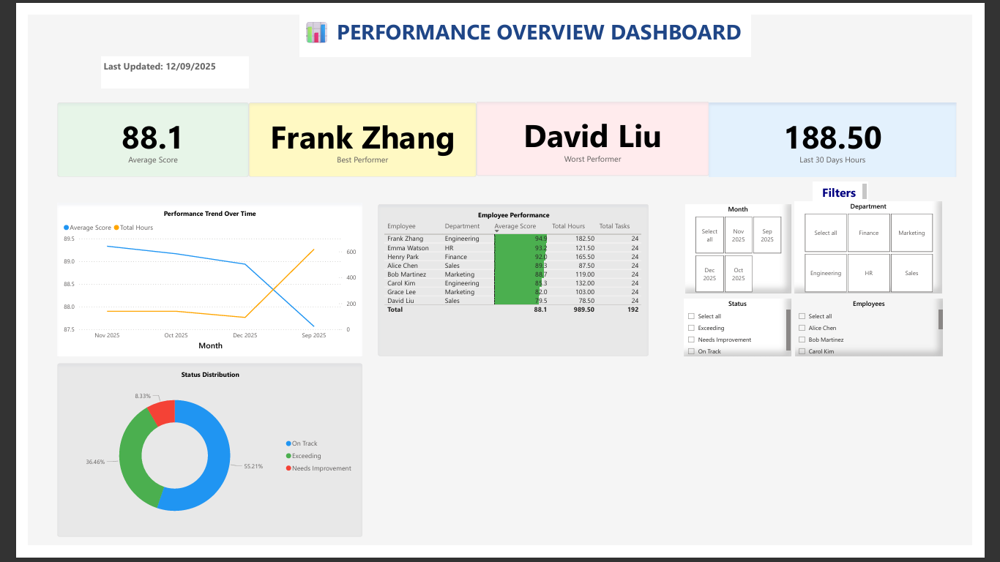
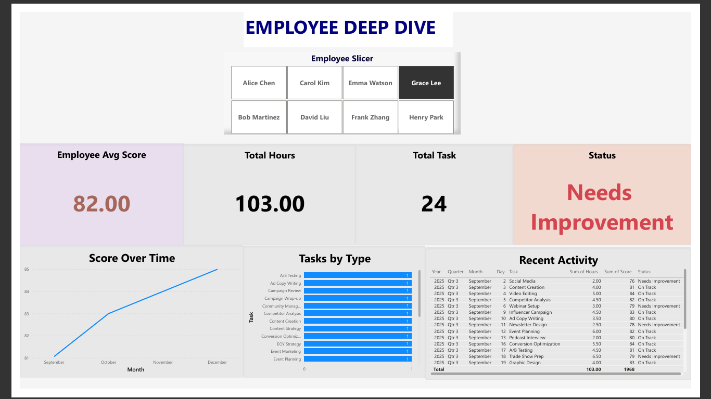
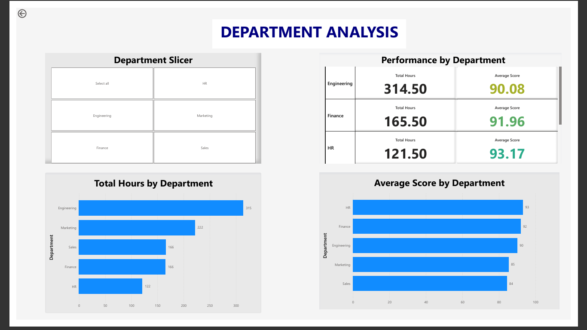
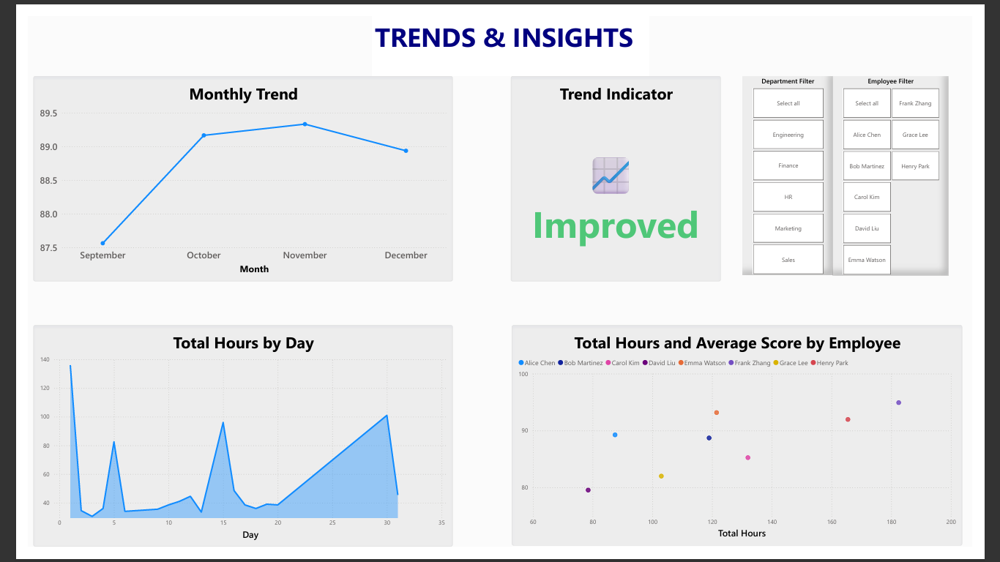

# 📊 Performance Dashboard

An interactive, professional-grade performance analytics dashboard built with **Exel, Power BI** and **React**. Track employee performance, analyze departmental trends, and gain actionable insights through dynamic visualizations.



---

## 🚀 **Live Demo**

- **Interactive HTML Version**: [View Live Demo](https://github.com/JackDatanerd/Performance-Dashboard/)
- **Power BI File**: Download `Performance-Dashboard.pbix` to explore in Power BI Desktop

---

## ✨ **Features**

### 📈 **Overview Dashboard**
- **KPI Cards**: Real-time metrics for average score, top/worst performers, and total hours
- **Performance Trends**: Dual-axis line chart showing score and hours over time
- **Status Distribution**: Pie chart with percentage breakdown of employee statuses
- **Employee Performance Table**: Sortable table with conditional formatting

### 👤 **Employee Deep Dive**
- Individual employee performance metrics
- Score trends over time
- Task-level breakdown
- Recent activity history

### 🏢 **Department Analysis**
- Average score comparison across departments
- Total hours worked by department
- Department performance matrix

### 📊 **Trends & Insights**
- Monthly performance trends
- Hours vs Score correlation (scatter plot)
- Predictive insights and patterns

---

## 🛠️ **Tech Stack**

### **Power BI Version**
- **Power BI Desktop**: Data modeling and visualization
- **DAX**: Custom measures and calculations
- **Power Query**: Data transformation and cleaning

### **HTML/React Version**
- **React 18**: Component-based UI
- **Recharts**: Interactive chart library
- **Tailwind CSS**: Modern, responsive styling
- **Vanilla JavaScript**: CSV parsing and data processing

---

## 📁 **Project Structure**

```
Performance-Dashboard/
├── data/
│   └── performance_data.csv         
├── screenshots/
│   ├── dashboard-overview.png
│   ├── employee-deep-dive.png
│   ├── department-analysis.png
│   └── trends-insights.png
├── Performance-Dashboard.pbix        
├── Performance-Dashboard.pdf         
├── index.html                        
└── README.md                        
```

---

## 🎯 **How to Use**

### **Option 1: Power BI Desktop**

1. **Download Power BI Desktop** (free): [Download Here](https://powerbi.microsoft.com/desktop/)
2. **Open** `Performance-Dashboard.pbix`
3. **Interact** with slicers, filters, and drill-throughs
4. **Customize** with your own data by replacing the data source

### **Option 2: Interactive HTML Dashboard**

1. **Download** `index.html`
2. **Open** in any modern browser (Chrome, Firefox, Safari, Edge)
3. **Upload your CSV** file with the required format:
   ```
   Date, Employee, Department, Task, Hours, Score, Status, Notes
   ```
4. **Explore** the interactive dashboard with real-time filtering

### **Option 3: GitHub Pages (Live Demo)**

Visit the live demo at: `https://github.com/JackDatanerd/Performance-Dashboard/`

---

## 📊 **Data Format**

Your CSV file should follow this structure:

| Column     | Type    | Description                      | Example              |
|------------|---------|----------------------------------|----------------------|
| Date       | Date    | Task completion date             | 2025-09-02           |
| Employee   | Text    | Employee name                    | Alice Chen           |
| Department | Text    | Department name                  | Sales                |
| Task       | Text    | Task description                 | Client Call          |
| Hours      | Number  | Hours spent on task              | 2.5                  |
| Score      | Number  | Performance score (0-100)        | 88                   |
| Status     | Text    | Performance status               | On Track             |
| Notes      | Text    | Additional notes (optional)      | Excellent follow-up  |

**Status Values**: `Exceeding`, `On Track`, `Needs Improvement`

---

## 🎨 **Key Metrics & Calculations**

### **DAX Measures (Power BI)**

```dax
Average Score = AVERAGE('performance_data'[Score])

Best Performer = 
VAR EmployeeScores = 
    ADDCOLUMNS(
        VALUES('performance_data'[Employee]),
        "AvgScore", CALCULATE(AVERAGE('performance_data'[Score]))
    )
VAR MaxScore = MAXX(EmployeeScores, [AvgScore])
RETURN
    MAXX(FILTER(EmployeeScores, [AvgScore] = MaxScore), 'performance_data'[Employee])

Last 30 Days Hours = 
CALCULATE(
    SUM('performance_data'[Hours]),
    'performance_data'[Date] >= TODAY() - 30,
    'performance_data'[Date] <= TODAY()
)

Trend Indicator = 
VAR Current = [Last 30 Days Avg Score]
VAR Previous = [Previous 30 Days Avg Score]
RETURN
    IF(Current >= Previous, "📈 Improved", "📉 Declined")
```

---

## 🎓 **Use Cases**

- **HR Analytics**: Track employee performance and identify training needs
- **Team Management**: Monitor workload distribution and productivity
- **Executive Reporting**: High-level KPIs for leadership dashboards
- **Portfolio Project**: Demonstrate data visualization and BI skills to recruiters

---

## 📸 **Screenshots**

### Overview Dashboard


### Employee Deep Dive


### Department Analysis


### Trends & Insights


---

## 🔧 **Customization**

### **Adding Your Own Data**

**Power BI:**
1. Open `Performance-Dashboard.pbix`
2. Go to **Home → Transform Data**
3. Replace the data source with your CSV file
4. **Close & Apply**

**HTML Version:**
- Simply upload your CSV file through the interface
- The dashboard will automatically parse and visualize your data

### **Modifying Visuals**

- **Power BI**: Edit visuals directly in Power BI Desktop
- **HTML**: Modify the React components in `index.html` (search for `// CUSTOMIZATION`)

---

## 🤝 **Contributing**

Contributions are welcome! If you have ideas for improvements:

1. Fork the repository
2. Create a feature branch (`git checkout -b feature/AmazingFeature`)
3. Commit your changes (`git commit -m 'Add some AmazingFeature'`)
4. Push to the branch (`git push origin feature/AmazingFeature`)
5. Open a Pull Request

---

## 📝 **License**

This project is open source and available under the [MIT License](LICENSE).

---

## 👤 **Author**

**Jack Ongogo**
- GitHub: [@JackDatanerd](https://github.com/JackDatanerd/Performance-Dashboard)
- LinkedIn: [Jack Ongogo](https://www.linkedin.com/in/jack-ongogo-735015132/)
- Portfolio: [Website](https://jackdatanerd.github.io/jack-ongogo-website/)

---

## 🙏 **Acknowledgments**

- Data visualization best practices inspired by [Storytelling with Data](https://www.storytellingwithdata.com/)
- Power BI community for DAX formula insights
- React and Recharts documentation

---

## 📚 **Related Projects**

- [Habit Predictor Dashboard](https://github.com/JackDatanerd/Habit-Predictor) - AI-powered habit tracking and prediction
- [Sales Analytics Dashboard](https://github.com/JackDatanerd/Sales-Analytics) - Comprehensive sales performance analysis

---

**⭐ If you found this project helpful, please consider giving it a star!**
